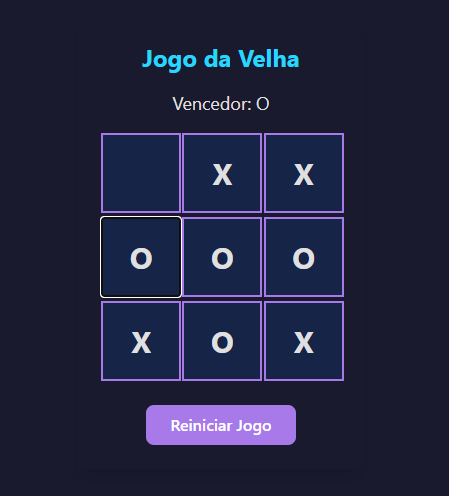

#  Tic-Tac-Toe (Jogo da Velha) com React e Vite

Este é um projeto clássico de Jogo da Velha construído com React, utilizando o Vite como ambiente de desenvolvimento rápido. O objetivo principal deste projeto foi praticar e demonstrar conceitos fundamentais do React.

## 📋 Sobre o Projeto

O foco foi a aplicação de conceitos essenciais como:
* **Componentização:** Divisão da interface em componentes reutilizáveis (`Board` e `Square`).
* **Gerenciamento de Estado:** Uso do hook `useState` para controlar o estado do tabuleiro, os turnos e o vencedor.
* **Props:** Comunicação de dados e funções entre componentes pais e filhos.
* **Event Handling:** Captura de cliques do usuário para atualizar o estado do jogo.
* **Animações:** Adição de microinterações com `Framer Motion` para uma experiência de usuário mais agradável.

## ✨ Tecnologias Utilizadas

O projeto foi construído utilizando as seguintes tecnologias:

[](https://skillicons.dev)

## 📸 Screenshot




## 🚀 Rodando o Projeto Localmente

Para rodar este projeto em sua máquina, siga os passos abaixo:

1.  **Clone o repositório:**
    ```bash
    git clone [https://github.com/tharcio09/jogo-da-velha-react.git](https://github.com/tharcio09/jogo-da-velha-react.git)
    ```

2.  **Entre no diretório do projeto:**
    ```bash
    cd jogo-da-velha-react
    ```

3.  **Instale as dependências:**
    ```bash
    npm install
    ```

4.  **Inicie o servidor de desenvolvimento:**
    ```bash
    npm run dev
    ```

O projeto estará disponível em `http://localhost:5173` (ou a porta indicada no seu terminal).

## 📝 Licença

Este projeto está sob a licença MIT.